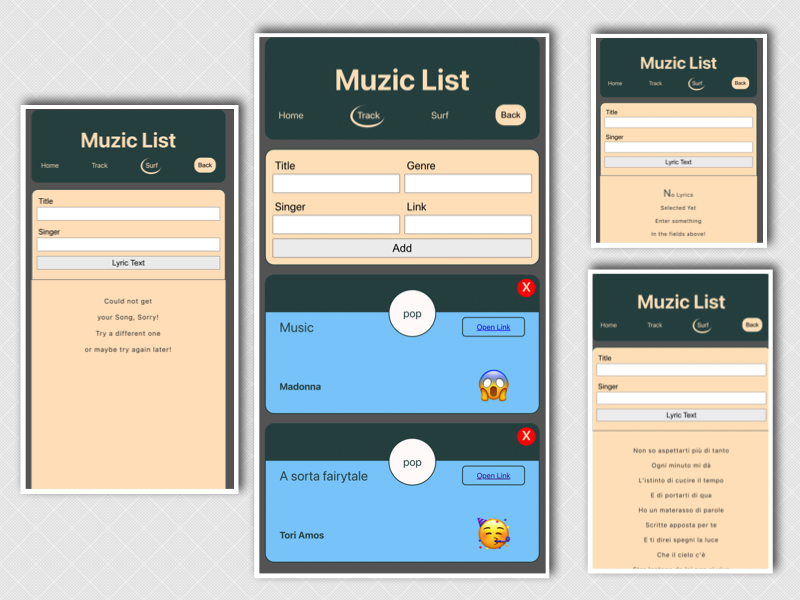

# Muzic Box 🎺

React App that allows the user to track interesting music/video clips and to fetch songs lyrics.

## Why this App 🤔

To learn to use React during the Futureproof Bootcamp - Auguste Cohort.



## How to use 💻

The app has been deployed on Netlify at [this address](https://muzic-list.netlify.app/).

### Run 🏃

To run the app locally, clone the repo and use the following command from the root folder:

```
npm start
```

### Test 🧪

To test the app, clone the repo and use one of the following commands from the root folder:

```
npm run test

npm run coverage
```

## Technologies 📡

- React (JS library to build UI)
- React Hooks:
  - useState (to work with each components' state)
  - useEffect (to mimic life-cycle events)
  - useNavigate (to harness the Browser's history object to navigate back to the previous page)
- React-router (to have multiple page in a single-page app)
- CSS-modules (for organised styling)
- Jest (as a test runner)
- React testing library (RTL - for the tests)
- Axios (to make fetch requests, smarter than fetch and isomorphic (can be used FE and BE))
- UUID (npm package used to generate uuids, Universally Unique Identifiers)

## Challenges 😫

- Testing (struggle to use mocks with Jest)
